### **Learning OpenGL**

## Description

This is my code for ["Learn OpenGL](https://learnopengl.com/)".

Each section in *src* folder corresponds to a certain chapter in the book.

## Examples

<div style="display: grid; grid-template-columns: repeat(3, 1fr); gap: 5px;">
  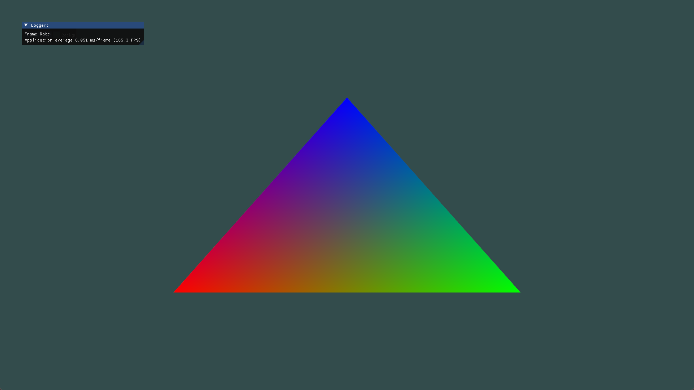
  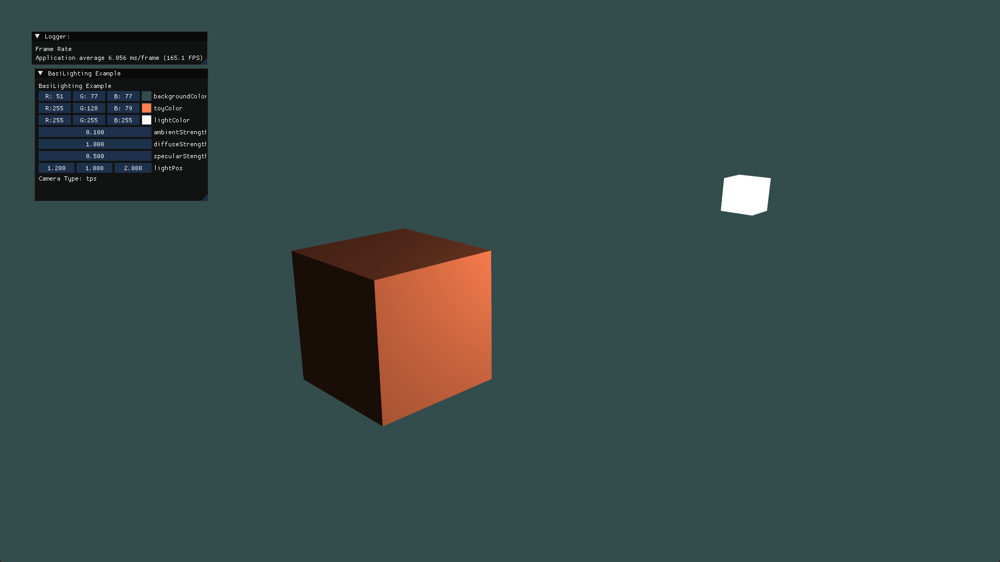
  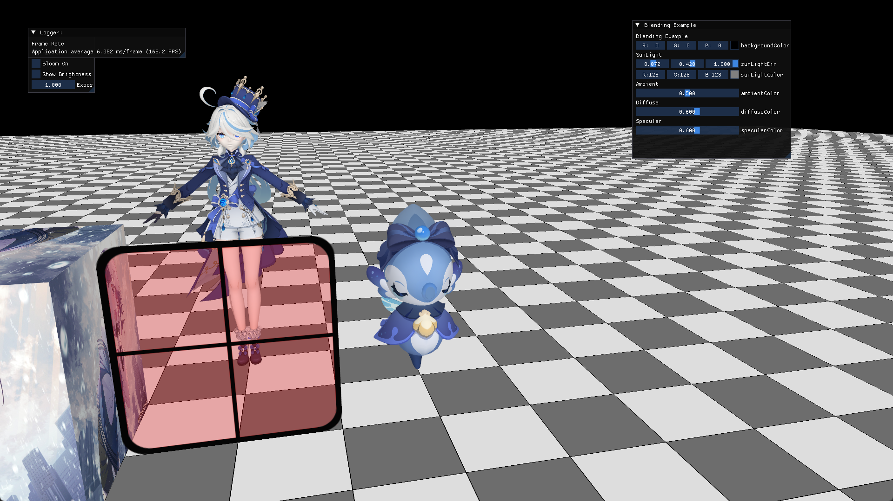
  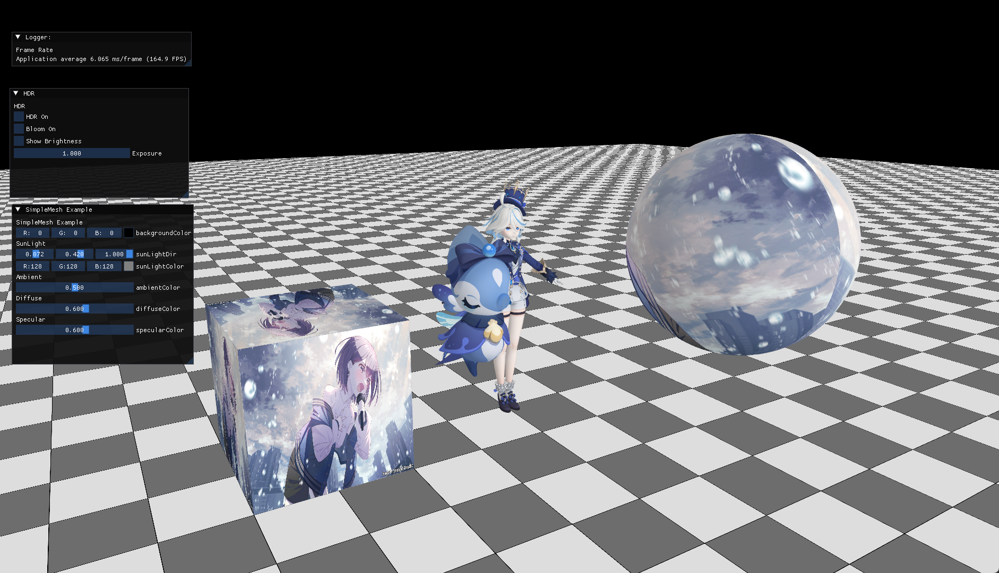
  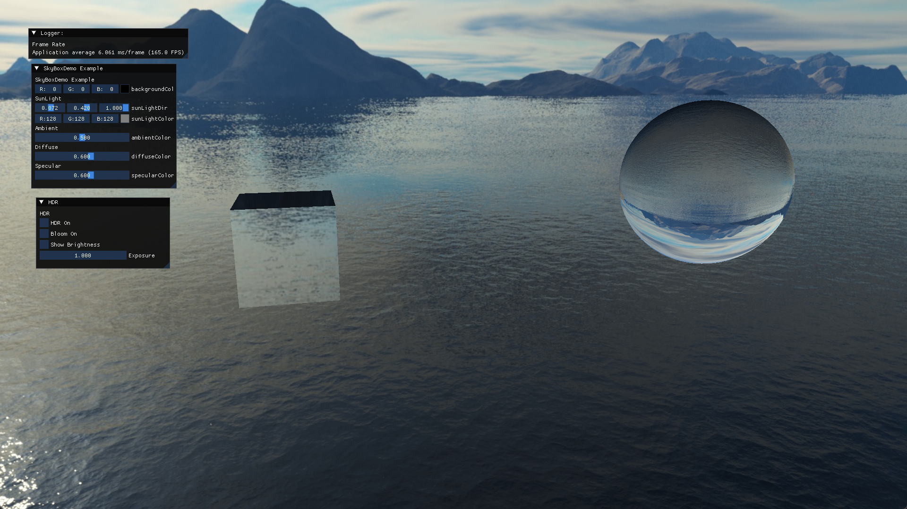
  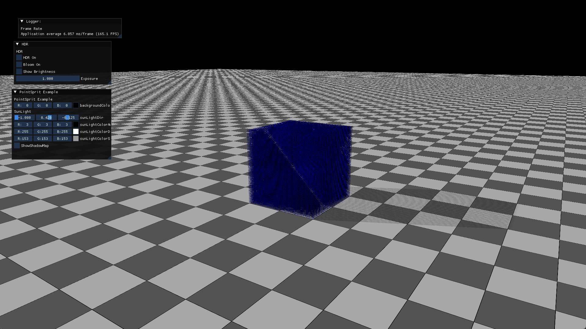
  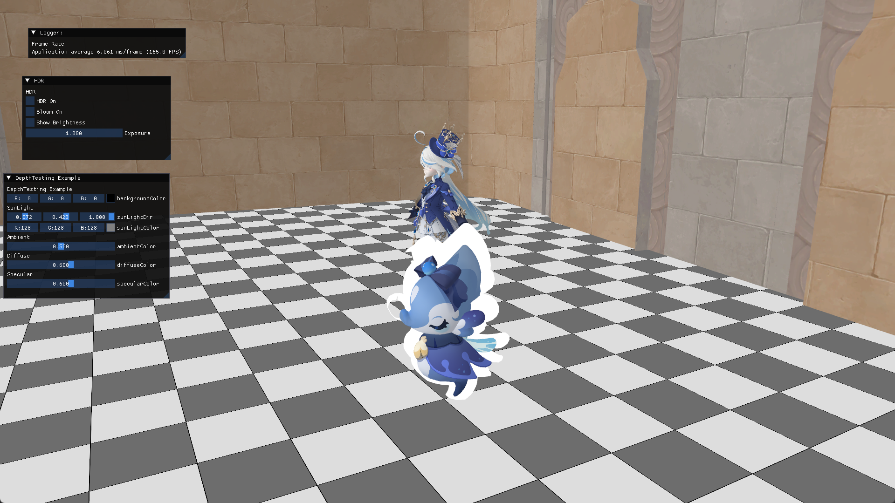
  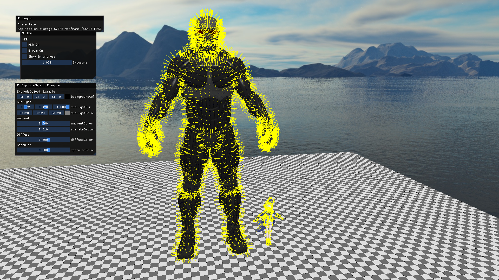
   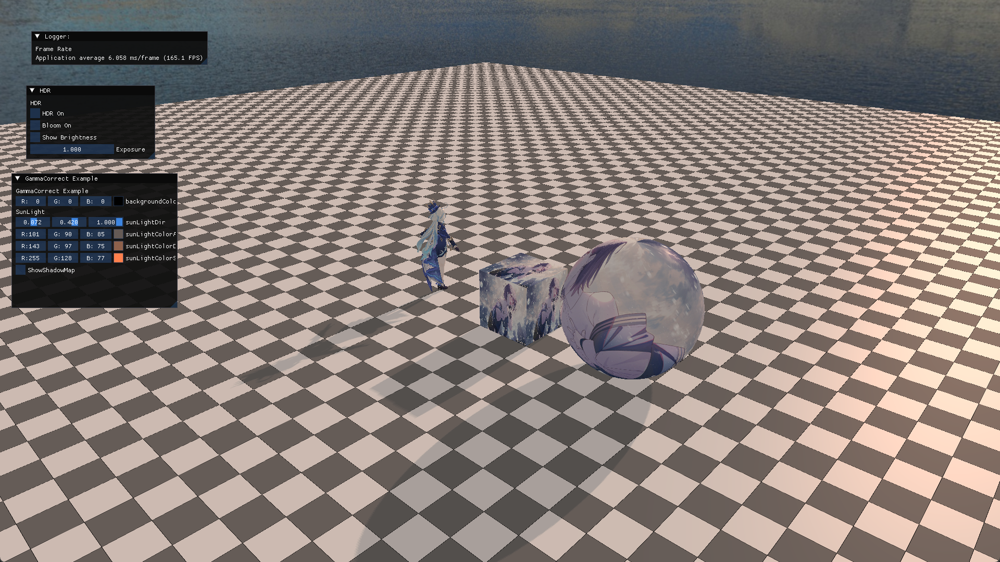
  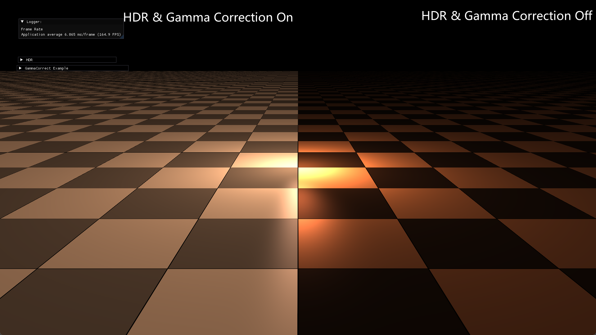
  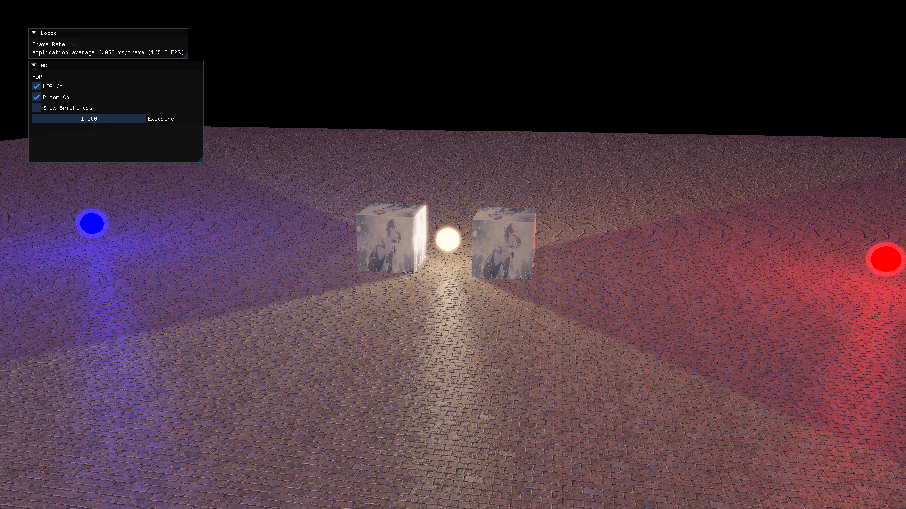
  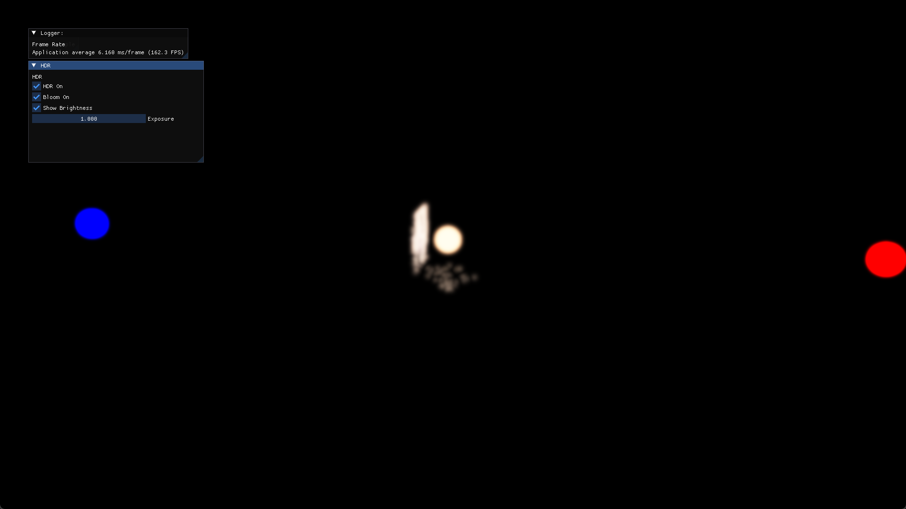
</div>


## How to build

#### Linux(Ubuntu)

```shell
sudo apt-get install build-essential mesa-common-dev libglew-dev cmake libopenexr-dev libassimp-dev
```

Make sure you have CUDA installed.

Clone this Repositories:

```shell
git clone https://github.com/Raining00/cuda-opengl-framework.git
cd cuda-opengl-framework
git submodule init
git submodule update
```

or simple use

```shell
git clone --recursive https://github.com/Raining00/cuda-opengl-framework.git
```

Make sure you have cmake installed. Then config this project:

```shell
cmake . -B build -DCMAKE_BUILD_TYPE=RelWithDebInfo
cmake --build build --config RelWithDebInfo -j
```

If compilation fails inexplicably or takes much long time, you might be running out of memory. Try running the above command without `-j` in that case.

#### Windows:

Make sure you have visual studio and CUDA installed.

Installing git from [**here**](https://git-scm.com/downloads) and cmake from [**here**](https://cmake.org/download/).

I recommend you to install [**vcpkg**](https://github.com/microsoft/vcpkg.git). Please refer to the instructions on the vcpkg homepage for installation and configuration, and make sure you have integrated vcpkg in visual studio.

```shell
.\vcpkg.exe integrate install
```

Use vcpkg to install the assimp library:

```
.\vcpkg.exe install assimp:x64-windows
```

This may take a while.

Open Windows cmd or powershell, clone this Repositories:

```shell
git clone --recursive https://github.com/Raining00/cuda-opengl-framework.git
```

create a folder named build in root directory and launch cmake-gui, choose **"Where is the source code"** as repositories' root path and "**Where to build the binaries**:" as "**build**" folder that you create just now.

Then press "Config" and "Generate". The visual studio project will be generated in the build folder(end with ".sln").

